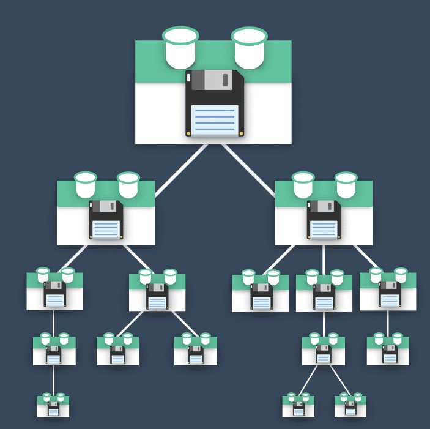

#脚手架搭建

shift + 鼠标右键 打开 powershell


创建的名字中不能有大写字母


不使用 history mode， 默认哈希，因为history需要后端的工作。使用less


ESLint对代码进行修正


在保存的时候修正


存放在单个文件中


## package.json

```json
{
  "name": "vue-manage-platform", // 项目的名称
  "version": "0.1.0", // 项目的版本号
  "private": true, // 将项目标记为私有，防止意外发布到公共包管理器
  "scripts": {
    "serve": "vue-cli-service serve", // 用于启动开发服务器的命令
    "build": "vue-cli-service build", // 用于构建生产版本的命令
    "lint": "vue-cli-service lint" // 用于运行代码风格检查的命令
  },
  "dependencies": { //包含了项目在运行时所需的依赖项，通常是生产环境所需的包
    "core-js": "^3.8.3", // 项目所依赖的核心JavaScript库的版本
    "element-ui": "^2.15.14", // 项目依赖的Element UI框架的版本
    "vue": "^2.6.14", // 项目依赖的Vue.js的版本
    "vue-router": "^3.5.1", // 项目依赖的Vue Router的版本
    "vuex": "^3.6.2" // 项目依赖的Vuex的版本
  },
  
  "devDependencies": { // 包含了开发时需要的依赖项，例如构建工具、测试框架、代码质量工具等。这种分离有助于减小生产环境的包大小，并确保不必要的工具不会部署到生产服务器上。
    "@babel/core": "^7.12.16", // 开发环境依赖的Babel核心的版本
    "@babel/eslint-parser": "^7.12.16", // 用于ESLint解析的Babel插件的版本
    "@vue/cli-plugin-babel": "~5.0.0", // Vue CLI的Babel插件的版本
    "@vue/cli-plugin-eslint": "~5.0.0", // Vue CLI的ESLint插件的版本
    "@vue/cli-plugin-router": "~5.0.0", // Vue CLI的Vue Router插件的版本
    "@vue/cli-plugin-vuex": "~5.0.0", // Vue CLI的Vuex插件的版本
    "@vue/cli-service": "~5.0.0", // Vue CLI的服务插件的版本
    "@vue/eslint-config-standard": "^6.1.0", // Vue项目使用的ESLint配置的版本
    "eslint": "^7.32.0", // 项目使用的ESLint工具的版本
    "eslint-plugin-import": "^2.25.3", // 用于支持ESLint的import规则的插件的版本
    "eslint-plugin-node": "^11.1.0", // 用于支持ESLint的Node.js规则的插件的版本
    "eslint-plugin-promise": "^5.1.0", // 用于支持ESLint的Promise规则的插件的版本
    "eslint-plugin-vue": "^8.0.3", // 用于支持ESLint的Vue.js规则的插件的版本
    "less": "^4.2.0", // 项目依赖的Less CSS预处理器的版本
    "less-loader": "^8.1.1", // 用于Webpack的Less加载器的版本
    "vue-template-compiler": "^2.6.14" // 用于编译Vue模板的版本
  }
}

```


## vue.config.js


#Element脚手架中的使用

##安装

npm i element-ui -S


##全局引入

```js
import Vue from 'vue';
import ElementUI from 'element-ui';
import 'element-ui/lib/theme-chalk/index.css';
import App from './App.vue';

Vue.use(ElementUI);

new Vue({
  el: '#app',
  render: h => h(App)
});
```


# Vue路由的使用

## 组件定义时设置的name和路由定义时设置的name的区别

当在Vue.js中定义组件时，`name`属性用于指定该组件的名字，以便在开发工具和调试中更容易识别和跟踪组件。下面是一个带有注释的代码示例，演示如何在Vue组件中使用`name`属性：

```vue
<template>
  <div>
    <h1>Hello, {{ message }}</h1>
  </div>
</template>

<script>
export default {
  // Vue组件的名字，用于开发和调试
  name: 'HelloWorld', // 组件的名字

  data() {
    return {
      message: 'World'
    };
  }
};
</script>
```

在这个示例中：

- `name: 'HelloWorld'` 是为Vue组件指定名字。这个名字在**开发工具中可见**，有助于开发者追踪和调试组件。

- `data()` 方法定义了一个名为`message`的数据属性，用于在模板中显示 "World"。

虽然在路由设置中也可以使用`name`属性，但在路由中的使用方式略有不同。以下是一个路由配置示例，以演示如何在路由中使用`name`属性：

```javascript
import Vue from 'vue';
import VueRouter from 'vue-router';
import HelloWorld from '@/components/HelloWorld.vue';

Vue.use(VueRouter);

const routes = [
  {
    path: '/',
    name: 'home', // 路由的名字
    component: HelloWorld
  }
];

const router = new VueRouter({
  routes
});

export default router;
```

在这个示例中：

- `name: 'home'` 是路由的名字，它与Vue组件的名字是不同的。路由的名字用于在路由配置和导航中引用路由，以便在代码中进行路由导航。

所以，Vue组件的`name`属性用于组件本身的识别和调试，而路由的`name`属性用于路由的配置和导航。尽管它们可能具有相似的名字，但在不同上下文中具有不同的用途。


# 首页UI搭建


首页布局


安装less和less解析器

```
npm i less
npm i less-loader
```

在Home组件中放入首页布局，App.vue中使用 routerview


# slot


默认显示SUBMIT，在插槽中间写上默认内容


## 具名插槽

有时，一个组件拥有多个插槽很有用。让我们看一下现代 Web 应用程序中的常见 UI 组件来探索这个概念。


如果您使用过任何大型社交媒体平台，您都会见过这样的组件。它通常称为媒体对象或媒体框。如您所见，它显示用户头像、标题和段落。

用户头像可以是它自己的组件，然后我们可以插入**标题和段落**。我们可以首先为它们添加两个插槽，如下所示：


**`<slot>` 元素有一个特殊的 attribute：`name`。这个 attribute 可以用来定义额外的插槽。**

**在向具名插槽提供内容的时候，我们可以在一个 `<template>` 元素上使用 `v-slot` 指令，并以 `v-slot` 的参数的形式提供其名称。**

**v-slot 只能添加在 <template> 上** (只有[一种例外情况](https://v2.cn.vuejs.org/v2/guide/components-slots.html#%E7%8B%AC%E5%8D%A0%E9%BB%98%E8%AE%A4%E6%8F%92%E6%A7%BD%E7%9A%84%E7%BC%A9%E5%86%99%E8%AF%AD%E6%B3%95))，这一点和已经废弃的 [`slot` attribute](https://v2.cn.vuejs.org/v2/guide/components-slots.html#%E5%BA%9F%E5%BC%83%E4%BA%86%E7%9A%84%E8%AF%AD%E6%B3%95) 不同。


**MediaBox.vue** 问题版

```Vue
 <template>
      <div>
        <UserAvatar/>
        <slot></slot>
        <slot></slot>
        //有两个插槽
      </div>
</template>

//但是当我们尝试使用这个组件时遇到了一个问题：

<MediaBox>
      <h2>Adam Jahr</h2>
      <p>My words.</p>
</MediaBox>

//Vue 不知道哪些内容应该放入哪个槽中。
//我们需要明确并指定内容的去向，我们可以通过具名插槽来做到这一点。
```

**MediaBox.vue** 具名插槽版

```vue
<template>
      <div>
        <slot name="heading"></slot>
        <slot name="paragraph"></slot>
      </div>
</template>
//现在，我们可以在slot将插入的模板代码的属性中使用该名称。

非常重要：
<MediaBox>
      <h2 v-slot:heading>Adam Jahr</h2>
      <p v-slot:paragraph>My words.</p>
</MediaBox>
//我们正在将标题和段落插入到我们想要的位置。
```


# 侧边栏实现

elementUI提供了**NavMenu 导航菜单**

分为顶栏和侧栏，提供折起和展开

```vue
<template>
  <el-container style="height: 100%">
    <el-aside width="auto">
      <common-aside></common-aside> //使用侧边栏导航组件，注意是小写，单词之间用短划线隔开
    </el-aside>
    <el-container>
      <el-header>Header</el-header>
      <el-main>Main</el-main>
    </el-container>
  </el-container>
</template>

<script>
import CommonAside from '@/components/CommonAside.vue' //引入侧边栏组件
export default {
  // eslint-disable-next-line vue/multi-word-component-names
  name: 'Home',
  components: {
    CommonAside
  },
  data () {
    return {}
  }

}
```

在Vue挂载的app中默认设置为1屏的高度

```vue
<style>
  #app{
    height: 100vh;
  }
</style>
```


**将侧边栏的导航分为有子菜单的和无子菜单的**

```vue
//菜单中的数据
data () {
    return {
      isCollapse: false,
      menu: [
        {
          path: '/',
          name: 'home',
          label: '首页',
          icon: 's-home',
          url: 'Home/Home'
        },
        {
          path: '/mall',
          name: 'mall',
          label: '商品管理',
          icon: 'video-play',
          url: 'MallManage/MallManage'
        },
        {
          path: '/user',
          name: 'user',
          label: '用户管理',
          icon: 'user',
          url: 'UserManage/UserManage'
        },
        {
          label: '其他',
          icon: 'location',
          children: [
            {
              path: '/page1',
              name: 'page1',
              label: '页面1',
              icon: 'setting',
              url: 'Other/PageOne'
            },
            {
              path: '/page2',
              name: 'page2',
              label: '页面2',
              icon: 'setting',
              url: 'Other/PageTwo'
            }
          ]
        }
      ]
    }
  },


//使用计算属性进行区分
computed: {
    noChildren () {
      return this.menu.filter(item => !item.children)
    },
    hasChildren () {
      return this.menu.filter(item => item.children)
    }
  }

//无子菜单进行遍历 index是EL组件自己的属性，意为唯一标志
<el-menu-item v-for="item in noChildren" @click="clickMenu(item)" :index="item.path" :key="item.path">
      <template v-slot:title>
// v-slot必须用在template（只有一种特殊情况）
        <i :class="'el-icon-' + item.icon"></i>
//图标用拼接的形式实现
        <span >{{item.label}}</span>
      </template>
    </el-menu-item>

//有子菜单进行遍历
<el-submenu v-for="item in hasChildren" :index="item.path" :key="item.path">
    <template v-slot:title>
      <i :class="'el-icon-'+item.icon"></i>
      <span>{{item.label}}</span>
    </template>
    <el-menu-item-group v-for="subItem in item.children" :key="subItem.path">
      <el-menu-item :index="subItem.path">{{ subItem.label }}</el-menu-item>
    </el-menu-item-group>
</el-submenu>
```


**去掉页面整体的白边**      （暂时无效，不知道哪里出了问题）

```
//去掉页面的白边
html, body{
    margin: 0;
    padding: 0;
  }
```


# 路由跳转初步设置

## 页面结构与路由设置


```JS
//路由设置
const routes = [
  {
    path: '/',
    name: 'Main',
    component: () => import('../views/Main.vue'),
    children: [
      {
        path: '/home',
        name: 'home',
        component: () => import('../views/home/index.vue')
      },
      {
        path: '/user',
        name: 'user',
        component: () => import('../views/user/index.vue')
      }
    ]
  }
]
```


## 路由跳转

### 路由跳转设置解析

```vue
//router下的index.js文件中
const routes = [
  {
    path: '/',
    name: 'Main',
    component: () => import('../views/Main.vue'),
    children: [
      {
        path: '/home',
        name: 'home',
        component: () => import('../views/home/index.vue')
      },
      {
        path: '/user',
        name: 'user',
        component: () => import('../views/user/index.vue')
      }
    ]
  }
]

//CommonAside组件中
<el-menu-item v-for="item in noChildren" @click="clickMenu(item)" :index="item.path" :key="item.path">
      <template v-slot:title>
        <i :class="'el-icon-' + item.icon"></i>
        <span >{{item.label}}</span>
      </template>
  </el-menu-item>

//注意click点击事件
clickMenu (item) {
      this.$router.push({
        name: item.name
      })
    }

```

**解析：**

`clickMenu` 函数能够实现路由跳转的原因是因为它使用了Vue Router库的 `$router.push()` 方法来进行页面路由的切换。

`this.$router.push()` 方法用于导航到不同的路由，具体来说，它使用 `item.name` 来确定要导航到的路由。

`clickMenu` 函数接收一个 `item` 参数，这个参数代表了菜单项的信息，其中包括 `item.name`。`item.name` 在菜单项对象中是路由的名称。通过 `this.$router.push({ name: item.name })`，你告诉Vue Router去激活具有指定名称的路由，从而导航到相应的页面。

所以，当你点击菜单项时，`clickMenu` 函数根据被点击菜单项的路由名称（`item.name`），触发了Vue Router的路由切换，从而实现了页面的跳转。


`clickMenu` 函数与路由配置中的 `name` 属性相关。在你的路由配置中，有一个名为 `Main` 的路由，它是你的主视图组件。 `Main` 路由有两个子路由：`home` 和 `user`，它们分别具有 `name` 属性为 `'home'` 和 `'user'`。

当你调用 `this.$router.push({ name: item.name })` 来触发路由导航时，`item.name` 的值应该匹配路由配置中的某个路由的 `name` 值。在你的示例中，`item.name` 应该匹配 `Main`、`home` 或 `user` 中的一个，以便导航到相应的路由。

所以，`clickMenu` 函数与路由配置中的 `Main`、`home` 和 `user` 三个路由的 `name` 属性相关。


### this.$

`this.$router.push` 中的 `$` 符号表示 Vue.js 中的实例属性。在 Vue.js 应用中，你可以通过 `this.$` 来访问全局的 Vue 实例的属性和方法。

- `this`：代表当前 Vue 组件的实例。
- `$router`：是 Vue Router 的实例，它允许你进行前端路由导航。
- `.push`：是 Vue Router 提供的一个方法，用于导航到不同的路由。


###编程式导航

除了使用 `<router-link>` 创建 a 标签来定义导航链接，我们还可以借助 router 的实例方法，通过编写代码来实现。

`router.push(location, onComplete?, onAbort?)`

注意：在 Vue 实例内部，**你可以通过 $router 访问路由实例**。因此你可以调用

```
this.$router.push
```

想要导航到不同的 URL，则使用 `router.push` 方法。这个方法会向 history 栈添加一个新的记录，所以，当用户点击浏览器后退按钮时，则回到之前的 URL。

当你点击 `<router-link>` 时，这个方法会在内部调用，所以说，点击 `<router-link :to="...">` 等同于调用 `router.push(...)`。

| 声明式                       | 编程式                |
| ------------------------- | ------------------ |
| `<router-link :to="...">` | `router.push(...)` |

该方法的参数可以是一个字符串路径，或者一个描述地址的对象。例如：

```js
// 字符串
router.push('home')

// 对象
router.push({ path: 'home' })

// 命名的路由
router.push({ name: 'user', params: { userId: '123' }})

// 带查询参数，变成 /register?plan=private
router.push({ path: 'register', query: { plan: 'private' }})

```

**注意：如果提供了 path，params 会被忽略，上述例子中的 query 并不属于这种情况。取而代之的是下面例子的做法，你需要提供路由的 name 或手写完整的带有参数的 path：**

```js
const userId = '123'
router.push({ name: 'user', params: { userId }}) // -> /user/123
router.push({ path: `/user/${userId}` }) // -> /user/123
// 这里的 params 不生效
router.push({ path: '/user', params: { userId }}) // -> /user

```

同样的规则也适用于 `router-link` 组件的 `to` 属性。

在 2.2.0+，可选的在 `router.push` 或 `router.replace` 中提供 `onComplete` 和 `onAbort` 回调作为第二个和第三个参数。这些回调将会在导航成功完成 (在所有的异步钩子被解析之后) 或终止 (导航到相同的路由、或在当前导航完成之前导航到另一个不同的路由) 的时候进行相应的调用。在 3.1.0+，可以省略第二个和第三个参数，此时如果支持 Promise，`router.push` 或 `router.replace` 将返回一个 Promise。

**注意**： 如果目的地和当前路由相同，只有参数发生了改变 (比如从一个用户资料到另一个 `/users/1` -> `/users/2`)，你需要使用 [`beforeRouteUpdate`](https://v3.router.vuejs.org/zh/guide/essentials/dynamic-matching.html#%E5%93%8D%E5%BA%94%E8%B7%AF%E7%94%B1%E5%8F%82%E6%95%B0%E7%9A%84%E5%8F%98%E5%8C%96) 来响应这个变化 (比如抓取用户信息)。


`router.replace(location, onComplete?, onAbort?)`

跟 `router.push` 很像，唯一的不同就是，它不会向 history 添加新记录，而是跟它的方法名一样 —— 替换掉当前的 history 记录。

| 声明式                               | 编程式                   |
| --------------------------------- | --------------------- |
| `<router-link :to="..." replace>` | `router.replace(...)` |

`router.go(n)`

这个方法的参数是一个整数，意思是在 history 记录中向前或者后退多少步，类似 `window.history.go(n)`。

例子

```
// 在浏览器记录中前进一步，等同于 history.forward()
router.go(1)

// 后退一步记录，等同于 history.back()
router.go(-1)

// 前进 3 步记录
router.go(3)

// 如果 history 记录不够用，那就默默地失败呗
router.go(-100)
router.go(100)

```


**操作 History**

你也许注意到 `router.push`、 `router.replace` 和 `router.go` 跟 [`window.history.pushState`、 `window.history.replaceState` 和 `window.history.go` (opens new window)](https://developer.mozilla.org/en-US/docs/Web/API/History)好像， 实际上它们确实是效仿 `window.history` API 的。

因此，如果你已经熟悉 [Browser History APIs (opens new window)](https://developer.mozilla.org/en-US/docs/Web/API/History_API)，那么在 Vue Router 中操作 history 就是超级简单的。

还有值得提及的，Vue Router 的导航方法 (`push`、 `replace`、 `go`) 在各类路由模式 (`history`、 `hash` 和 `abstract`) 下表现一致。


## 注意点

当在Vue.js中定义组件时，`name`属性用于指定该组件的名字，以便在开发工具和调试中更容易识别和跟踪组件。下面是一个带有注释的代码示例，演示如何在Vue组件中使用`name`属性：

```vue
<template>
  <div>
    <h1>Hello, {{ message }}</h1>
  </div>
</template>

<script>
export default {
  // Vue组件的名字，用于开发和调试
  name: 'HelloWorld', // 组件的名字

  data() {
    return {
      message: 'World'
    };
  }
};
</script>
```

在这个示例中：

- `name: 'HelloWorld'` 是为Vue组件指定名字。这个名字在开发工具中可见，有助于开发者追踪和调试组件。

- `data()` 方法定义了一个名为`message`的数据属性，用于在模板中显示 "World"。

虽然在路由设置中也可以使用`name`属性，但在路由中的使用方式略有不同。以下是一个路由配置示例，以演示如何在路由中使用`name`属性：

```javascript
import Vue from 'vue';
import VueRouter from 'vue-router';
import HelloWorld from '@/components/HelloWorld.vue';

Vue.use(VueRouter);

const routes = [
  {
    path: '/',
    name: 'home', // 路由的名字
    component: HelloWorld
  }
];

const router = new VueRouter({
  routes
});

export default router;
```

在这个示例中：

- `name: 'home'` 是路由的名字，它与Vue组件的名字是不同的。路由的名字用于在路由配置和导航中引用路由，以便在代码中进行路由导航。

所以，Vue组件的`name`属性用于组件本身的识别和调试，而路由的`name`属性用于路由的配置和导航。尽管它们可能具有相似的名字，但在不同上下文中具有不同的用途。


# header组件搭建

header组件分为两个部分，左边部分是导航图标+面包屑，右边部分是用户图标+下拉菜单


导航图标


面包屑


Dropdown下拉菜单


靠左、靠右布局，左右贴边同时上下居中


通过导航图标控制aside部分的展开和收起


# Vuex

## Vuex 简介

关于 Vuex 4 的注意事项
Vuex 4 最近发布，这是最新版本的 Vuex，专为与 Vue 3 兼容而设计。几乎所有 Vuex 4 的 API 与 Vuex 3 保持相同，而本课程所教授的正是 Vuex 3。然而，有一些重大变更，您可以在这里了解。


状态管理的必要性
在充满组件的应用程序中管理状态可能会变得困难。Facebook 曾经吃过苦头，因此创建了Flux模式，而 Vuex 就是基于这一模式开发的。Vuex 是 Vue 自家的状态管理模式和库。在本课程中，我们将探讨应用程序为何需要 Vuex 以及它如何增强您的应用。

当我们谈论状态时，指的是组件所依赖和渲染的数据，比如博客文章、待办事项等。没有 Vuex，随着应用程序的增长，每个 Vue 组件可能都会拥有自己的状态副本。



**但如果一个组件改变了其状态，而远处的另一个组件也在使用同一状态，我们需要进行状态的通信**。有一种默认的方式是通过向上传递事件和向下传递属性来共享数据，但这可能会变得非常复杂。


相反，我们可以将所有的状态集中到一个地方，一个包含整个应用程序的当前状态的位置。这样就形成了一个单一的真相来源。


**因此，我们为什么不把组件的共享状态抽取出来，以一个全局单例模式管理呢？在这种模式下，我们的组件树构成了一个巨大的“视图”，不管在树的哪个位置，任何组件都能获取状态或者触发行为！**


`单一的真相来源`
这就是 Vuex 提供的功能，每个组件都可以`直接访问全局状态`。

与 Vue 实例的数据一样，这个状态是`响应式`的。当一个组件更新状态时，正在使用该数据的其他组件会得到通知，自动接收到新的值。


然而，仅仅将数据集中到单一的真相来源并不能完全解决状态管理的问题。当许多组件以不同的方式、来自不同的位置改变状态时，会出现什么情况？

我们需要一些标准化。否则，对状态的更改可能会变得难以预测和追踪。


`状态管理模式`
这就是为什么 Vuex 提供了一个完整的状态管理模式，以便以一种简单且标准化的方式进行状态更改。如果您熟悉 Vue，那么 Vuex 应该看起来相当类似。


就像 Vue 提供了通过 `new Vue` 创建的根 Vue 实例一样，Vuex 提供了通过 `new Vuex.Store` 创建的存储库。

而 Vue 实例具有 `data` 属性，Vuex 存储库具有 `state`。两者都是响应式的。

而实例具有`方法`，其中包括更新数据的方法，存储库具有 `Actions`，它们可以更新状态。

而实例具有`计算属性`，存储库具有 `getters`，允许我们访问经过筛选、派生或计算的状态。

此外，Vuex 提供了一种跟踪状态更改的方式，称为 `Mutations`。我们可以使用 `Actions` 来提交 `Mutations`，并且通过 `Vue DevTools`，甚至可以通过每个 `Mutations` 到状态的记录来追溯状态更改的历史。


 `Vuex Store示例`


在`state`中，我们有一个名为 `isLoading` 的属性，以及一个 `todos` 数组。


在下面，我们有一个 `mutation` 用于在 `isLoading` 状态之间切换 true 和 false。还有一个 `mutation` 用于使用我们在下面的 `Action` 中从 API 调用中接收到的 todos 设置我们的状态。


我们的 `Action` 在这里有多个步骤。首先，它会提交 `Mutation` 将 `isLoading` 状态设置为 true。然后它将进行 API 调用，当响应返回时，它将提交 `Mutation` 将 `isLoading` 状态设置为 false。最后，它将提交 `Mutation` 使用来自 API 的响应设置我们的 `todos` 的状态。

如果我们需要只检索标记为已完成的 `todos` 的能力，我们可以使用一个 `Getter`，它将仅检索我们想要的特定状态。


### Vuex in Motion


###Vuex 核心概念

Vuex 是一个用于管理应用程序状态的状态管理模式和库。它通常与 Vue.js 框架一起使用，用于构建大型的、复杂的单页应用程序（SPA）。Vuex 帮助开发者管理应用中的数据、状态和状态变化，使得数据共享和维护更加容易。

1. **State（状态）**：这是应用程序的数据源，即应用的状态。Vuex 将整个应用的状态存储在一个单一的对象中，可以在整个应用中共享和访问。

2. **Getters（获取器）**：Getters 用于从状态中派生出一些衍生数据，类似于 Vue 组件中的计算属性。它们可以帮助你在组件中获取和使用状态的部分数据，而不需要直接访问状态对象。

3. **Mutations（突变）**：Mutations 是用于修改状态的方法。它们必须是同步的，用于跟踪状态的变化。每个 Mutation 都有一个字符串类型的事件名和一个回调函数，用于实际地改变状态。

4. **Actions（动作）**：Actions 用于执行异步操作并提交 Mutations 来改变状态。它们允许你处理复杂的业务逻辑、数据获取以及其他异步操作。Actions 通过触发 Mutations 来改变状态。

5. **Modules（模块）**：当你的应用变得复杂时，你可以将 Vuex 的状态、Mutations、Getters 和 Actions 划分为模块，每个模块可以独立管理一部分状态。

Vuex 的主要目标是让状态管理更加可维护、可预测和可调试，特别是在大型应用程序中。它提供了单一数据源的概念，使状态变化变得可追踪，从而减少了状态管理方面的混乱。这使得多个组件可以共享和响应应用状态的变化，同时保持一致性。这些特性使得 Vuex 成为 Vue.js 应用程序中的强大工具，特别是在构建复杂的单页应用时。


## State & Getters

**状态（State）与派生状态（Getters）**：
在上一课中，我们简要了解了 Vuex 的工作原理。在本教程中，我们将看看如何从我们的组件中直接和借助 Getters 访问 Vuex 存储的 State 数据。

###访问 `state`（状态）

如果我们查看我们的 main.js 文件，我们可以看到我们导入了我们的 Vuex store文件并将其提供给我们的根 Vue 实例。这是因为我们在使用 Vue CLI 创建项目时选择了 Vuex。

```javascript
import store from './store'

new Vue({
  router,
  store, // <-- 将`store`注入以实现全局访问
  render: h => h(App)
}).$mount('#app')
```

通过将`store`注入到每个组件中，这使得`store`在整个应用程序中可以全局访问，这样任何组件都可以使用 `$store` 来访问存储以及其中的属性（如 State、Actions、Mutations 和 Getters）。


现在让我们添加一些 State，以便我们可以查看如何从组件中访问它。我们可以创建一个`user`对象：

```javascript
state: {
  user: { id: 'abc123', name: 'Adam Jahr' }
}
```

我们可以从应用程序中的任何地方访问这个`user` State，但由于我们将很快创建需要知道是哪个用户创建了它们的事件，让我们从 EventCreate.vue 文件中访问这个 State。

```html
<template>
  <h1>创建事件，{{ $store.state.user }}</h1>
</template>
```

这可以生效，但请注意在浏览器中，我们显示了整个`user`对象。我们可以使用`.`符号来指定我们想要显示的用户 State 中的确切属性。在这种情况下，我们只想显示`name`。

```html
<template>
  <h1>创建事件，{{ $store.state.user.name }}</h1>
</template>
```


现在，我们看到了用户的名字。但如果我们需要在组件中的多个地方使用用户的名字怎么办？当然，我们可以在各个地方都写 `this.$store.state.user.name`，或者我们可以在**计算属性**中只写一次，名为 `userName`。

这样，我们的模板变得更加可读，减少了冗余。

```javascript
computed: {
  userName() {
    return this.$store.state.user.name;
  }
}
```

这样，我们的模板变得更加可读，减少了冗余。

```html
<h1>创建事件，{{ userName }}</h1>
<p>此事件由{{ userName }}创建</p>
```

如果我们需要在组件的方法中使用它，我们可以简单地说 `this.userName`。


###`mapState` 辅助函数

如果我们需要从同一个组件访问 State 的不同部分，多次编写 `this.$store.state.something` 可能会变得冗长和重复。为了简化这一点，我们可以使用 `mapState` 辅助函数，**它会为我们生成计算属性**。

首先，让我们向 Vuex  Store中添加更多 State，以便看到它的作用。我们将添加一个事件类别的数组：

```javascript
state: {
  user: { id: 'abc123', name: 'Adam Jahr' },
  categories: ['sustainability', 'nature', 'animal welfare', 'housing', 'education', 'food', 'community']
}
```

现在，在 EventCreate.vue 中，我们可以导入 `mapState`：

```javascript
import { mapState } from 'vuex'
```

然后使用它来将我们的 State 映射到一个计算属性中，以便检索用户的名字和我们的类别。

```javascript
computed: mapState({
  userName: state => state.user.name,
  categories: state => state.categories
})
```

请注意，我们使用了一个箭头函数l来接收 state 并返回我们想要的 state 属性，例如 `state.user.name` 和 `state.categories`。

如果我们想要访问顶层的 State（不使用点符号），可以更简单地这样写：

```javascript
computed: mapState({
  userName: state => state.user.name,
  categories: 'categories' // <-- 顶层 State 的简化语法
})
```

请注意，我们只需要使用 State 的字符串值` 'categories'`，这相当于 `state => state.categories`。

我们还可以通过传递一个字符串数组来更简化 `mapState` 的语法，如下所示：

```javascript
computed: mapState(['categories', 'user'])
```

当然，在我们的模板中，现在只需要使用点符号来访问用户的名字。

```html
<h1>创建事件，{{ user.name }}</h1>
```


**对象扩展运算符**

正如您可能已经注意到的，`mapState` 返回一个计算属性的对象。但它目前阻止我们添加不与我们的存储 State 相关的其他本地计算属性。

为了做到这一点，我们可以使用对象扩展运算符，它允许我们在这里**混入其他计算属性**。

```javascript
computed: {
  localComputed() {
    return something
  },
  ...mapState(['categories', 'user']) // <-- 使用对象扩展运算符
}
```


###Getters

虽然我们可以直接访问 **Store’s State**，但有时我们希望访问派生状态，也就是在访问时以某种方式处理状态。

例如，我们可能想知道有多少个类别，而不是访问我们的 State's `categories`。换句话说，我们可能想知道类别数组的长度。

从组件内部，我们可以这样写：

```javascript
this.$store.state.categories.length
```

但如果多个组件需要使用相同的值怎么办？通过创建一个 **Vuex Getter**，我们可以避免不必要的代码重复。此外，由于 Getters 被缓存，这也是一种性能更好的选择。

让我们在我们的Store中添加一个 Getter。

**store.js**

```javascript
catLength: state => {
  return state.categories.length
}
```

如您所见，Getters 是一个接受`state`作为参数的函数，**允许我们返回经过处理或筛选的状态。**


现在让我们在 EventCreate 组件中使用我们的 `catLength` Getter。与访问 State 一样，我们将它放在一个计算属性中。

```javascript
computed: {
  catLength() {
    return this.$store.getters.catLength
  }
}
```


**将 Getters 传递给 Getters**：
如果我们需要获取要与另一个 Getter 一起处理的 State，我们可以将 Getters 作为第二个参数传递给 Getter。这允许我们从我们正在创建的 Getter 中访问另一个 Getter。这听起来有点复杂，但是让我们看一个简单的例子。

假设我们的 State 中有一个待办事项数组。

```javascript
todos: [
  { id: 1, text: '...', done: true },
  { id: 2, text: '...', done: false },
  { id: 3, text: '...', done: true },
  { id: 4, text: '...', done: false }
]
```

我们可以创建一个 Getter 来获取已完成的待办事项数组。

```javascript
doneTodos: (state) => {
  return state.todos.filter(todo => todo.done)
}
```

我们可以在另一个 Getter 中使用此 Getter，如果要找出尚未完成的待办事项的数量，可以这样做：

```javascript
activeTodosCount: (state, getters) => {
  return state.todos.length - getters.doneTodos.length
}
```

现在，我们可以返回已完成的待办事项数量与所有待办事项数量之间的差异。

也许你会想知道为什么我们不只是像下面这样直接编写 `activeTodosCount`。

```javascript
activeTodosCount: (state) => {
  return state.todos.filter(todo => !todo.done).length
}
```

当然，我们可以这样做。这个例子只是为了演示将 Getters 传递给另一个 Getter 的强大之处。

**动态 Getters**：
您可能会想知道是否可以使用动态 Getters，换句话说，是否可以根据参数检索某些状态。答案是可以，通过返回一个函数来实现。

例如，如果我们有一个事件数组，我们可以这样检索一个事件：

```javascript
getEventById: (state) => (id) => {
  return state.events.find(event => event.id === id)
}
```

然后在我们的组件中，我们可以这样写：

```javascript
computed: {
  getEvent() {
    return this.$store.getters.getEventById
  }
}
```

在我们的模板中，我们可以传递一个参数。

```html
<p>{{ getEvent(1) }}</p>
```

请注意，像这样的动态 Getters 每次调用时都会运行，结果不会被缓存。

**mapGetters 辅助函数**：
就像我们在访问 State 时所见，我们可以使用 `mapGetters` 辅助函数将 Getters 映射到组件的计算属性上，以便在其中访问。首先，我们只需要导入它：

```javascript
import { mapGetters } from 'vuex'
```

然后可以这样使用它：

```javascript
computed: mapGetters([
  'categoriesLength',
  'getEventById'
])
```

现在，我们在组件中有一个映射到我们的 Getters 的计算属性数组。

如果我们想要在一个对象中重命名这些 Getters，我们可以在对象中这样做：

```javascript
computed: mapGetters({
  catCount: 'categoriesLength',
  getEvent: 'getEventById'
})
```

这样，`this.catCount` 映射到 `this.$store.getters.categoriesLength`，`getEvent` 映射到 `this.$store.getters.getEventById`。

**对象扩展运算符**：
正如您可能已经想象的，如果您希望将这些 Getters 混合到本地计算属性中，您也可以在这里使用对象扩展运算符。

```javascript
computed: {
  localComputed() {
    return something
  },
  ...mapGetters({
    catCount: 'categoriesLength',
    getEvent: 'getEventById'
  })
}
```

希望这能帮助您更好地理解 Vuex 中的 State 和 Getters。State 用于存储应用程序的数据，Getters 用于计算和派生这些数据，以便您能够更轻松地在组件中访问它们。


## Mutations & Actions Pt. 1

现在我们可以访问 Vuex 状态，我们可以开始将应用程序的数据存储在其中。通过使用 Vuex，我们可以使用 Mutation 将数据放入状态中。在本教程中，我们将学习 Mutations，然后看看如何将 Mutations 包装在 Actions 中，以使它们更具可扩展性和未来性。

###Mutations

正如我们在 Vuex 入门课程中了解的那样，我们可以使用 Mutations 来更新或更改状态。

举一个简单的例子，假设我们的状态具有一个 `count` 属性：

**store.js**

```javascript
state: {
  count: 0
}
```

现在，在我们的状态下方，我们可以编写一个 mutation，允许我们增加该值。

**store.js**

```javascript
mutations: {
  INCREMENT_COUNT(state) {
    state.count += 1
  }
}
```


`INCREMENT_COUNT` Mutation 以 Vuex 状态作为参数，并将其用于递增 count。

现在，让我们从组件内部**提交该 Mutation**。在 EventCreate 组件内部，我们将添加一个方法：

```javascript
incrementCount() {
  this.$store.commit('INCREMENT_COUNT')
}
```

在这里，我们的 `incrementCount` 方法只是提交了它可以访问的 `INCREMENT_COUNT` Mutation，通过使用this.$store


如果我们添加一个按钮，我们可以单击它来触发此 Mutation。

```html
<button @click="incrementCount">Increment</button>
```

通过查看 Vue DevTools，我们可以看到我们的 count 在 Vuex 标签中正在更新。

此外，还要注意我们的 Mutation 也在 DevTools 中记录下来了。如果我们点击 `Base State`，我们能够看到在提交 Mutation 之前我们应用程序的状态。换句话说，count 重新变为 0。

这使我们能够进行“time-travel debugging”，以便我们可以看到应用程序在某个时间点的状态，以及我们的 Mutations 如何影响了我们的状态。

为什么要全大写？**如果你想知道为什么我们的 Mutation 使用全大写**，那是因为在基于 Flux 的模式中，通常将它们用全大写表示。这是完全可选的，通常也可以看到 Mutations 以驼峰命名法编写。但是，将它们全部大写会使你在扫描文件时更容易立即看到可用的 Mutations，也会在提交 Mutation 与 Action、Getter 等时更清晰。但再次强调，选择权在你（或你的团队）手中。


**动态 Mutations**
目前，我们只是逐个增加 count。如果我们想按动态值更新它怎么办？我们可以将有效载荷传递给 Mutation 以使其具有动态性。

为了看到这一点，让我们在模板中添加一个输入，然后使用 v-model 将其绑定到名为 incrementBy 的新数据属性。

```html
<input type="number" v-model.number="incrementBy">
```

请注意，我们使用 .number 修饰符将输入值强制转换为数字。

然后，我们将 incrementBy 值从数据中作为有效载荷传递到我们提交 Mutation 的地方。

```javascript
incrementCount() {
  this.$store.commit('INCREMENT_COUNT', this.incrementBy)
}
```

在我们的 Vuex 存储中，INCREMENT_COUNT Mutation 可以在其第二个参数中接收有效载荷，并使用它来动态更新我们的 count。

```javascript
INCREMENT_COUNT(state, value) {
  state.count += value
}
```

现在，不管输入中键入了什么数字，都可以用它来更新我们的 count 状态。


###Actions

尽管 Vuex Mutations 是同步的，也就是说它们将一个接一个地发生，但 Actions 可以是**异步**的。它们可以包含多个步骤，实际发生的顺序可能不同于它们的编写顺序。如果您还记得我们关于 API 的课程，Axios 可以异步运行函数。

我们可以使用 Actions 来包装一些关于 Mutation 或 Mutations 的业务逻辑。

在我们的 Vuex 入门课程中，我们看到一个 Action 可以编写以提交一个 Mutation，将 isLoading 状态设置为 true，然后进行 API 调用，当调用返回响应时，它提交一个 Mutation 来将 isLoading 状态设置为 false，然后再提交一个 Mutation 来使用 API 的响应设置 todos 状态。


重要的是要理解，**Action 中的 Mutations 可能会被提交，也可能不会**，这取决于周围的逻辑和情况如何发展。

举个现实中的例子，如果我请我的朋友从商店买些面包，那么这里的 Mutation 将是 `PICK_UP_BREAD`，而 Action 更像是 `pleasePickUpBread`。**请求某人做某事与他们实际去做之间有很大的区别**。

有很多原因可能会导致她无法提交该 Mutation，她的车可能在前往商店的途中抛锚，或者商店可能没有面包。因此，Actions 更像是表达了一种意愿或渴望，根据周围的情况，使状态发生变化。

现在让我们看看 Actions 如何发挥作用。


**Actions 的运作**
回到我们的计数器示例，如果我们只想在我们的应用程序具有用户时才更新 count，我们可以编写：

```javascript
actions: {
  updateCount({ state, commit }, incrementBy) {
    if (state.user) {
      commit('INCREMENT_COUNT', incrementBy)
    } 
  }
}
```

这里发生了什么？

我们创建了一个名为 `updateCount` 的 **Action**。它使用对象解构从 Vuex 对象中获取` state` 和` commit`：{ state, commit }。

上下文对象是任何 Action 的第一个参数，它公开了与 store 实例上相同一组属性（state、mutations、actions

、getters）一样。因此，您可以调用 context.commit 来提交 Mutation，例如 context.state.count 来获取 count 状态的值。

此外，updateCount 接收有效载荷值。

```javascript
({ state, commit }, value)
```

有效载荷是所有 Actions 的第二个参数。

我们的 Action 检查是否在我们的状态中存储了一个用户。如果有，我们将使用传递的有效载荷值 commit INCREMENT_COUNT Mutation。如果没有用户，Mutation 将不会被提交。

现在，在我们的组件中，我们将分发该 Action，这将提交 Mutation。

```javascript
incrementCount() {
  this.$store.dispatch('updateCount', this.incrementBy)
}
```

值得注意的是，建议始终从 Action 中提交 Mutation。尽管如果您的 Mutation 当前不需要任何业务逻辑，这可能起初看起来像是多余的代码，但这样做使您的应用程序更具未来性，并使其更容易扩展。现在添加 Action 要容易得多，而不是以后需要时重构应用程序中的大量代码。

现在我们知道如何提交 Mutations 并将它们包装在 Action 中，让我们为我们的示例应用程序添加更多内容。

为我们的示例应用程序添加内容
目前，在我们的应用程序中，我们只是从我们的模拟 API 中获取事件。但我们希望用户能够创建新事件，该事件将添加到 Vuex Store 中。我们将添加一个 Mutation 并从一个 Action 中提交它。

但首先，我们需要安装一个新的依赖项。

安装我们的日期选择器
我们即将构建一个用于创建新事件的表单。但是，我们需要一个日期选择器用于我们的表单，因此让我们下载一个流行的外部库：vuejs-datepicker。

从命令行中，我们将写入：npm install vuejs-datepicker --save

这将安装库到我们的项目中，以便我们可以开始使用它。

创建事件
让我们前往我们的 EventCreate 组件，因为正如其名称所示，我们将使用它来创建新事件。就像我们之前使用 v-model 将值绑定到我们的数据的输入元素和提交 Mutation 的按钮一样，我们将使用相同的过程，但是一个扩展版本，带有一个可以从用户那里收集数据的表单。

以下是我们表单的模板。请注意，我们正在使用我们新添加的日期选择器。

```html
<form>
  <label>选择一个类别</label>
  <select v-model="event.category">
    <option v-for="cat in categories" :key="cat">{{ cat }}</option>
  </select>
  <h3>命名和描述您的事件</h3>
  <div class="field">
    <label>标题</label>
    <input v-model="event.title" type="text" placeholder="添加事件标题"/>
  </div>
  <div class="field">
    <label>描述</label>
    <input v-model="event.description" type="text" placeholder="添加描述"/>
  </div>
  <h3>您的事件在哪里？</h3>
  <div class="field">
    <label>地点</label>
    <input v-model="event.location" type="text" placeholder="添加地点"/>
  </div>
  <h3>您的事件什么时候？</h3>
  <div class="field">
    <label>日期</label>
    <datepicker v-model="event.date" placeholder="选择日期"/>
  </div>
  <div class="field">
    <label>选择时间</label>
    <select v-model="event.time">
      <option v-for="time in times" :key="time">{{ time }}</option>
    </select>
  </div>
  <input type="submit" class="button -fill-gradient" value="提交"/>
</form>
```

正如您所见，我们正在问一系列问题，并使用 v-model 在输入元素上绑定用户的响应到我们的数据。

现在，让我们一起查看这个组件的脚本部分，然后一一解释它。

```javascript
<script>
import Datepicker from 'vuejs-datepicker'
export default {
  components: {
    Datepicker
  },
  data() {
    const times = []
    for (let i = 1; i <= 24; i++) {
      times.push(i + ':00')
    }
    return {
      event: this.createFreshEvent(),
      times,
      categories: this.$store.state.categories,
    }
  },
  methods: {
    createFreshEvent() {
      const user = this.$store.state.user
      const id = Math.floor(Math.random() * 10000000)
      return {
        id: id,
        category: '',
        organizer: user,
        title: '',
        description: '',
        location: '',
        date: '',
        time: '',
        attendees: []
      }
    }
  }
}
</script>
```

让我们拆分一下。

```javascript
import Datepicker from 'vuejs-datepicker'
export default {
  components: {
    Datepicker
  }
```

在顶部，我们导入了我们的新日期选择器并将其注册为子组件，以便我们可以在我们的模板中使用它。

```javascript
data() {
  const times = []
  for (let i = 1; i <= 24; i++) {
    times.push(i + ':00')
  }
  return {
    ...
    times
  }
```

然后在我们的数据中，我们使用一个小算法生成一个用于时间的数字数组。请注意，上面在我们的数据中，{ times } 等同于 { times: times }。如果将此逻辑放在这里看起来很奇怪，记住 data() 是一个函数，因此您完全可以在其中执行一些初始的数据逻辑。

```html
<select v-model="event.time">
  <option v-for="time in times" :key="time">{{ time }}</option>
</select>
```

然后，在模板中，我们正在使用 v-for 循环遍历 times。

现在，让我们看看我们数据的其余部分。

```javascript
return {
  event: this.createFreshEventObject(),
  categories: this.$store.state.categories,
  times
}
```

我们直接从 Vuex Store 中获取我们的类别，并在选项元素上使用 v-for，就像

之前的 times 一样。但我们在 event 数据方面做了一些特殊的事情。

```javascript
event: this.createFreshEventObject(),
```

与其将事件对象直接放在数据中，我们在组件创建时调用一个生成新事件对象的方法。

该方法如下：

```javascript
createFreshEventObject() {
  const user = this.$store.state.user
  const id = Math.floor(Math.random() * 10000000)
  return {
    id: id,
    category: '',
    organizer: user,
    title: '',
    description: '',
    location: '',
    date: '',
    time: '',
    attendees: []
  }
}
```

我们从 Vuex Store 中获取用户，然后返回一个带有我们想要收集数据的所有属性的对象，包括一个用我们的用户状态填充的属性。我们还为我们的 id 创建了一个随机数，并使用它来设置事件的 id。

您可能会想知道为什么我们要使用这种方法。为什么不在数据本身上拥有所有这些属性？当我们提交事件时，我们希望重置此组件的事件数据，而此方法是我们这样做的一个方便的方式。您将在稍后看到我们如何使用它。

如果我们不重置本地事件对象，我们可能会保留这个对象与我们推入状态的对象之间不必要的连接。

最后，我们只需要添加一个简单的作用域样式：

```css
.field {
  margin-bottom: 24px;
}
```

ADD_EVENT Mutation
现在，在我们的 Vuex Store 中，我们将编写一个 ADD_EVENT Mutation。

```javascript
ADD_EVENT(state, event) {
  state.events.push(event)
}
```

它接收一个事件参数，然后将其推送到我们的事件状态中。

createEvent Action
现在，我们想将其包装在一个 Action 中，我们将其称为 createEvent。

但首先，我们需要在 store.js 顶部导入我们的 EventService.js 文件。

```javascript
import EventService from '@/services/EventService.js'
```

因为我们将在我们的 Action 中使用它：

```javascript
createEvent({ commit }, event) {
  EventService.postEvent(event)
  commit('ADD_EVENT', event)
})
```

如您所见，我们的 Action 使用了我们在 Axios 进行 API 调用的课程中创建的 EventService 来执行 postEvent(event) 的 POST 请求，这将将事件添加到我们本地的 json.db 文件。

看到了吗？我们已经在我们的 EventService 文件中添加了一个新的 POST 请求：

EventService.js

```javascript
postEvent(event) {
  return apiClient.post('/events', event)
}
```

它接收一个事件，并可以将其 POST 到此端点，其中我们的模拟事件数据库位于其中。

然后，我们的 createEvent Action 提交了我们刚刚创建的 ADD_EVENT Mutation，这将事件添加到我们的本地事件状态，以便我们的应用程序的 UI 可能立即需要访问该新事件状态。

现在，让我们从我们的组件中调度此 Action。

分派 eventCreate Action
回到我们的 EventCreate 组件，我们可以添加一个将调度新 Action 的方法。

```javascript
methods: {
  createEvent() {
    this.$store.dispatch('createEvent', this.event)
  },
...
```

当我们提交表单时，我们将触发此方法，使用：

```html
<form  @submit.prevent="createEvent">
```

重置事件数据
之前提到过，我们希望在提交新事件时每次都重置组件的事件数据对象。

我们将这样做：

```javascript
createEvent() {
  this.$store.dispatch('createEvent', this.event)
  this.event = this.createFreshEventObject()
}
```

问题：但我们不希望在知道它已添加到后端之前清除我们的事件。如果我们的用户正在创建事件，单击提交按钮，然后走到电梯上，事件从未提交，他们将不得不重新开始创建事件。

解决方案：在我们的 Action 中，我们可以返回来自我们的 API 的响应。然后 .then 提交我们的 Mutation。

```javascript
createEvent({ commit }, event) {
  return EventService.postEvent(event).then( () => {
      commit('ADD_EVENT', event.data)
    })
}
```

现在，当事件成功 POST 时，我们将提交 ADD_EVENT。

并且我们甚至可以等待响应从我们的 EventCreate 组件返回，就像这样：

```javascript
createEvent() {
  this.$store.dispatch('createEvent', this.event)
    .then(() => {
      this.event = this.createFreshEventObject()
    })
    .catch(() => {
      console.log('创建事件时出现问题。')
    })
}
```

现在，在上面，只有在 POST 请求成功时，我们才会重置我们的事件数据（this.event）。

如果 POST 请求不成功，我们将在控制台中记录错误。在将来的课程中，我们将介绍如何有效地将此错误显示给用户。

路由到我们的新事件
一旦成功创建了事件，我们将希望查看该事件。换句话说，我们希望将用户路由到他们刚刚创建的事件的事件显示页面。

我们可以使用 router.push 方法来实现这一点，并将 id 参数设置为刚刚创建的 this.event 的 id。

```javascript
createEvent() {
  this.$store
    .dispatch('createEvent', this.event)
    .then(() => {
      this.$router.push({
        name: 'event-show',
        params: { id: this.event.id }
      })
      this.event = this.createFreshEventObject()
    })
    .catch(() => {
      console.log('创建事件时出现问题。')
    })
}
```

我们只需确保我们在剥离它以用于我们的路由参数之后清除事件，否则 this.event 将变为未定义。

调整 EventShow
现在，我们只需调整 EventShow 组件的模板，以便它不显示事件组织者的整个用户对象。

我们现在需要使用点符号显示 event.organizer.name，而且要使用三元运算符，以便在组件在渲染时没有其需要的数据之前不会出现 name 未定义的错误。

还记得吗？我们在早些课程中对出席者使用了这种方法：

```html
<span class="badge -fill-gradient">{{ event.attendees ? event.attendees.length : 0 }}</span>
```

所以现在让我们对我们的组织者名称也这样做：

```html
<h5>由{{ event.organizer ? event.organizer.name : '' }}组织</h5>
```

再次回顾
在这个课程中，我们学习了 Vuex Mutations 以及如何使用它们与执行潜在异步业务逻辑的 Actions。然后，我们将这些知识应用到了我们的示例应用程序中，以便我们的用户可以创建新事件，这些事件被添加到我们的模拟数据库以及 Vuex Store 中。


## Mutations & Actions Pt. 2


## Modules

在前两课中，我们使用了 Vuex 来封装我们应用的状态并标准化了状态的修改方式（通过 actions 和 mutations）。

然而，随着应用的增长，我们的 `store.js `文件会变得庞大。这时就可以使用 Vuex 模块来帮助我们组织代码并更容易进行测试。

🛑 问题：我们需要组织我们的代码
我们需要更好的方式来组织我们的 Vuex 代码，因为迄今为止，我们将所有内容都放在了 `store.js `文件中。

☑️ 解决方案
Vuex 提供了一个叫做模块（modules）的选项，它使我们可以将状态的不同部分拆分到不同的文件中。例如，如果您的应用程序具有事件和用户，**将所有state、mutations、actions 和 getters 都堆积在一个大的 /src/store.js 文件中是没有意义的**。相反，我们可以将这些功能分成两个独立的 Vuex  modules。


后续，我们可能会有更多的功能，例如事件有它们自己的评论，用户可以标记为“参加”。这些功能也可能成为拆分成自己的 Vuex 模块的候选项。

我们可以根据数据模型或功能来拆分我们的 Vuex 代码。如何实现这一点完全取决于您。


###基本用法

👈 回到示例应用
在我们的示例应用中，让我们从创建一个` store` 目录开始，将当前的 `store.js `文件移入其中。目前，让我们确保在此移动后，我们的app仍然可以正常工作，只需修改我们的 `main.js` 来查找新目录。我们只需将：

```javascript
import store from './store'
```

改为：

```javascript
import store from './store/store'
```

现在我们的 store.js 文件可以正常导入。


🏗️ **构建我们的第一个模块**
在实际构建第一个模块之前，我想在某个地方添加我们用户的名称。我将更改我们的主页标题，以显示当前用户的名称：

📃 /src/views/EventList.vue

```vue
<template>
  <div>
    <h1>Events for {{ user.name }}</h1>
    ...
</template>
<script>
    // 省略代码  
    ...mapState(['events', 'eventsTotal', 'user'])
  }
}
</script>
```

我们没有添加任何新代码。我只是想向您展示，我们的 store.js 包含了我们的用户数据，如下所示：

📃 /src/store/store.js

```javascript
...
export default new Vuex.Store({
  state: {
    user: { id: 'abc123', name: 'Adam Jahr' },
    ...
```

因此，当我们访问我们的主页时，我们会看到：


现在让我们构建我们的第一个user模块，因为在将来，当我们在示例app中构建身份验证时，我们将在这里放置更多的代码。为此，我们将创建一个新的 modules 文件夹，其中包含一个仅包含user state的新 user.js 文件。

📃 /src/store/modules/user.js

```javascript
export const state = {
  user: {
    id: 'abc123',
    name: 'Adam'  // 我移除了姓氏 Jahr，这样我们的标题就在一行上
  }
}
```

请注意，我在上面删除了 Adam 的姓氏，以使标题在一行上。如果您在跟随示例，请随意将其更改为您的名字。


**要使用此模块，我们需要将其包含在我们的 store.js 文件中**，如下所示：

📃 /src/store/store.js

```javascript
...
import * as user from '@/store/modules/user.js'
// 这将引入 user.js 中的所有常量 

Vue.use(Vuex)

export default new Vuex.Store({
  modules: {
    user  // 包括此模块
  },
  state: {
    categories: [
      'sustainability',
      // ...
```

为了在组件中使其工作，我们需要添加另一个` .user`：

📃 /src/views/EventList.vue

```vue
<template>
  <div>
    <h1>Events for {{ user.user.name }}</h1>
    ...
</template>
```

我们需要这样做是因为我们的模块状态现在在其名称下进行了范围化。当然，有一种方法可以避免输入 `user.user`，我们将在一会儿展示给您。

现在在浏览器中，我们可以看到一切都仍然正常工作，只是现在更有组织。

我注意到我们的代码还有一个地方需要更新以使用新的 User 模块。

📃 /src/views/EventCreate.vue

```javascript
<script>
...
    createFreshEventObject() {
      const user = this.$store.state.user // <----
      const id = Math.floor(Math.random() * 10000000)
      ...
```

在引用状态时，我们需要将 user 设置为 user.user，因此这行需要更新为：

```javascript
const user = this.$store.state.user.user // <----
```

🏗️ 创建一个事件模块
接下来，我将把我们的事件状态、mutations、actions 和 getters 移入其自己的 event.js 模块。这主要是一项大规模复制和粘贴工作，看起来如下：

📃 /src/store/modules/event.js

```javascript
import EventService from '@/services/EventService.js'

export const state = {
  events: [],
  eventsTotal: 0,
  event: {}
}
export const mutations = {
  ADD_EVENT(state, event) {
    state.events.push(event)
  },
  SET_EVENTS(state, events) {
    state.events = events
  },
  SET_EVENTS_TOTAL(state, eventsTotal) {
    state.eventsTotal = eventsTotal
  },
  SET_EVENT(state, event) {
    state.event = event
  }
}
export const actions = {
  createEvent({ commit }, event) {
    return EventService.postEvent(event).then(() => {
      commit('ADD_EVENT', event)
    })
  },
  fetchEvents({ commit }, { perPage, page }) {
    Event

Service.getEvents(perPage, page)
      .then(response => {
        commit('SET_EVENTS_TOTAL', parseInt(response.headers['x-total-count']))
        commit('SET_EVENTS', response.data)
      })
      .catch(error => {
        console.log('There was an error:', error.response)
      })
  },
  fetchEvent({ commit, getters }, id) {
    var event = getters.getEventById(id)
    if (event) {
      commit('SET_EVENT', event)
    } else {
      EventService.getEvent(id)
        .then(response => {
          commit('SET_EVENT', response.data)
        })
        .catch(error => {
          console.log('There was an error:', error.response)
        })
    }
  }
}
export const getters = {
  getEventById: state => id => {
    return state.events.find(event => event.id === id)
  }
}
```

唯一需要注意的新事物是，我将 import EventService from '@/services/EventService.js' 引入到此文件中，并且保留了 state 对象不变，与之前在 user.js 中的更改不同，因为在此模块中有多个状态属性。现在，我们需要在我们的 store.js 中使用此模块：

📃 /src/store/store.js

```javascript
import Vue from 'vue'
import Vuex from 'vuex'
import * as user from '@/store/modules/user.js'
import * as event from '@/store/modules/event.js'

Vue.use(Vuex)

export default new Vuex.Store({
  modules: {
    user,
    event
  },
  state: {
    categories: [ ... ]
  }
})
```

现在，如果我查看浏览器，什么都不会工作。我们现在必须通过 event.events、event.eventsTotal 和 event.event 来访问我们的事件、事件总数和事件状态。因此，我们需要进行两次文件更改。

首先，在 EventList 中：

📃 /src/views/EventList.vue

```vue
<template>
  <div>
    <h1>Events for {{ user.name }}</h1>
    <EventCard v-for="event in event.events" :key="event.id" :event="event"/>
    ...
</template>
```

如上所示，我们进行了三次更改，首先是在文件底部，我们将 mapState 更改为只访问 event（这是我们模块的名称）。然后，我们只需确保在访问状态的各个部分时使用 event.。

在我们的 EventShow.vue 中，我们在各个地方都在使用 event 对象，所以我们将以另一种方式解决这个问题，而不是编写 event.event.time 等。我们在状态和 Getter 的课程中已经介绍过了如何使用 mapState 帮手。

我们将 computed 从 computed: mapState(['event']) 更改为：

📃 /src/views/EventShow.vue

```javascript
...
computed: mapState({
  event: state => state.event.event
})
```

在这里，我们将组件的计算属性 event 映射到事件模块中的事件状态。

现在一切又按预期工作了，当我们在 EventShow.vue 文件中写 event.time 时，它被映射到 event.event。

模块的替代语法
最后，我想提一下，您可能会在实际开发中遇到另一种常见的模块语法。与其像这样导入一个模块：

📃 /src/store/store.js

```javascript
import * as event from '@/store/modules/event.js'
...
```

然后具有类似于此文件的模块文件：

📃 /src/store/modules/event.js

```javascript
import EventService from '@/services/EventService.js'

export const state = { ... }
export const mutations = { ... }
export const actions = { ... }
export const getters = { ... }
```

您可能会看到相同的模块编码为单个对象，而不是 5 个常量。

📃 /src/store/modules/event.js

```javascript
import EventService from '@/services/EventService.js'

export default {
  state: { ... },
  mutations: { ... },
  actions: { ... },
  getters: { ... }
}
```

然后通过以下方式导入：

📃 /src/store/store.js

```javascript
import event from '@/store/modules/event.js'
...
```

这两种语法都是正确的，第一种语法之所以更受青睐是因为它更容易创建私有变量和方法。但两者都可以使用。

访问其他模块中的状态
在我们关于 Actions 和 Mutations 的第一课中，我们创建了一个事件 Action，如下所示，现在在我们的 /store/modules/event.js 文件中。

```javascript
...
export const actions = {
  createEvent({ commit }, event) {
    return EventService.postEvent(event).then(() => {
      commit('ADD_EVENT', event)
    })
  }
```

将来，我们可能需要从这个 Action 中访问当前用户。如何做到呢？如果我们不在模块中，可以使用上下文对象来访问状态，如下所示：

```javascript
createEvent({ commit, state }, event) {
    
  console.log('User creating Event is ' + state.user.user.name)
  
  return EventService.postEvent(event).then(() => {
    commit('ADD_EVENT', event)
  })
}
```

然而，由于我们在模块中使用，这种方法不起作用。这里的 state 对象仅是我们本地模块的状态。因此，要访问用户的名称，我们需要使用 rootState，如其名称所示，它允许我访问 Vuex 状态的根部。

```javascript
createEvent({ commit, rootState }, event) {
    
  console.log('User creating Event is ' + rootState.user.user.name)
  
  return EventService.postEvent(event).then(() => {
    commit('ADD_EVENT', event)
  })
}
```

请注意，在 rootState.user.user.name 中，我访问了根状态，这使我可以访问用户模块，并且我可以从用户模块中请求名称状态。

如果要调用来自另一个模块的 Getter，可以以相同的方式使用 rootGetters。

访问另一个模块的 Actions
从一个 Action 中调用另一个模块的 Action 也很常见。要做到这一点，我们只需从上下文对象中发送 dispatch 并调用


# Vuex实现左侧折叠

